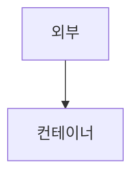
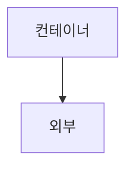

import Highlight from "@site/src/components/Highlight";
import UnderLine from "@site/src/components/UnderLine";

# 도커 컨테이너 실행

도커 이미지를 생성했다면 해당 이미지 기반으로 도커 컨테이너를 실행할 수 있습니다.

## 도커 컨테이너 실행

다음 명령어를 사용하여 도커 컨테이너를 실행할 수 있습니다.

```bash {3}
docker run -d -p 3000:3000 --name prod-express my-express

c80d541ba3b3d3d1b2476c39e7b79b6b63937cd5abf7717aed18f07a7e419395
```

**`-d`**<br />
도커 컨테이너를 백그라운드 프로세스로 실행합니다.<br/>
attached 모드(<Highlight>기본 값</Highlight>), detached 모드

**`-p 3000:3000`**<br/>
호스트의 3000번 포트와 컨테이너의 내부 3000번 포트를 매핑합니다. ([포트포워딩](https://ko.wikipedia.org/wiki/%ED%8F%AC%ED%8A%B8_%ED%8F%AC%EC%9B%8C%EB%94%A9))

**`--name`**<br/>
실행할 이미지 이름입니다.

**`--rm`**<br/>
컨테이너가 중지되면 해당 컨테이너가 제거되는 옵션입니다.

## 도커 컨테이너 상태 확인

다음 명령어를 사용하여 도커 컨테이너 상태를 확인할 수 있습니다.

```bash {4-5}
docker ps # 실행중인 컨테이너만 확인
docker ps -a # 중지된 컨테이너까지 확인

CONTAINER ID   IMAGE        COMMAND                  CREATED              STATUS              PORTS                    NAMES
c80d541ba3b3   my-express   "docker-entrypoint.s…"   About a minute ago   Up About a minute   0.0.0.0:3000->3000/tcp   prod-express
```

[http://localhost:3000](http://localhost:3000/)

## 도커 컨테이너 시작 & 중지 & 재시작

다음 명령어를 사용하여 도커 컨테이너를 시작 & 중지 & 재시작을 할 수 있습니다.

```bash
docker start `NAMES` 또는 `CONTAINER ID`
docker stop `NAMES` 또는 `CONTAINER ID`
docker restart `NAMES` 또는 `CONTAINER ID`
```

## 도커 컨테이너 로그 확인

다음 명령어를 사용하여 도커 컨테이너의 로그를 확인할 수 있습니다.

```bash
docker logs -f `NAMES` 또는 `CONTAINER ID`
```

## 도커 컨테이너 내부 접속

다음 명령어를 사용하여 도커 컨테이너 내부에 접속할 수 있습니다.

```bash
docker exec -it `NAMES` 또는 `CONTAINER ID` bash
```

**`exec`**<br/>
exec 명령은 Docker 컨테이너 내부에서 명령을 실행할 수 있도록 해주는 명령어입니다.

**`-i`**<br/>
표준 입력(stdin)을 활성화합니다. 컨테이너 내부에서 입력을 받을 수 있도록 합니다.

**`-t`**<br/>
터미널 환경을 활성화합니다. 컨테이너 내부에서 터미널을 사용할 수 있도록 합니다.

즉, **`-it`** 옵션을 사용하면 Docker 컨테이너 내부에서 터미널을 열고 입력을 받을 수 있게 됩니다. 이를 통해 컨테이너 내부에서 명령을 실행하거나 디버깅을 수행할 수 있습니다.

## 도커 컨테이너 파일 복사

### 외부 → 내부



```bash
docker cp dummy/. `NAMES` 또는 `CONTAINER ID`:/app
```

### 내부 → 외부



```bash
docker cp `NAMES` 또는 `CONTAINER ID`:/app/. dummy
```
