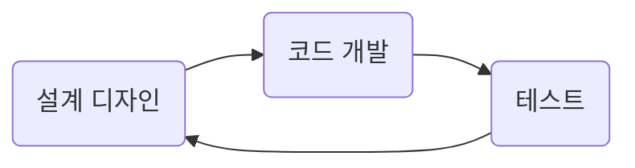

import Highlight from "@site/src/components/Highlight";
import UnderLine from "@site/src/components/UnderLine";
import Color from "@site/src/components/Color";

# Test-Driven Development

## TDD란 무엇인가?

TTD란? Test-Driven Development의 약자로 <UnderLine>테스트 주도 개발</UnderLine> 이라 하며 소프트웨어 개발 방법론 중 하나로, <Highlight>
코드를 작성하기 전에 먼저 테스트 케이스를 작성하고 이를 통과시키는 방법</Highlight>을 의미합니다. <UnderLine>TDD는 작가가 책을 쓰는 과정과 비슷</UnderLine>하다고도 합니다. 책을 쓸 때 목차를 처음 구성하고 이후 각 목차에 맞는 내용을 구상하여 초안을 작성하고 고쳐쓰기를 반복합니다.

이런 과정을 TDD에 비유하면 

- 목차 구성 → `테스트 케이스 작성`
- 초안 작성 → `코드 개발`
- 검토 → `테스트`
- 고쳐 쓰기 → `리팩토링`

반복적인 검토와 고쳐 쓰기를 통해서 좋은 글이 완성되는 것처럼 소프트웨어도 반복적인 테스트와 수정을 통해서 고품질의 소프트웨어를 만들 수 있습니다.

## TDD 개발 방식 vs 일반 개발 방식

### TDD 개발 방식

### 일반 개발 방식

 

|                              | TDD 개발 방식                                                                                                                                                                                             | 일반 개발 방식                                                                                                                                                      |
| ---------------------------- | --------------------------------------------------------------------------------------------------------------------------------------------------------------------------------------------------------- | ------------------------------------------------------------------------------------------------------------------------------------------------------------------- |
| 개발 순서                    | 테스트 케이스를 먼저 작성하고 이를 통과시키기 위한 코드를 작성합니다. 테스트를 통과하면 리팩토링을 수행합니다. 테스트가 코드 작성을 주도합니다.                                                           | 주로 코드를 먼저 작성하고, 그 후에 테스트를 작성하거나 테스트를 작성하지 않는 경우도 있습니다. 코드 작성이 주도합니다.                                              |
| 품질 관리                    | 코드 품질을 높이는 데 중점을 두며, 테스트를 통해 코드의 안정성과 신뢰성을 높입니다. 코드 변경 시 테스트를 실행하여 버그를 미리 감지하고, 코드 리팩토링을 통해 코드의 가독성과 유지 관리성을 향상시킵니다. | 품질 관리는 주로 코드 리뷰나 디버깅 단계에서 이루어지며, 테스트가 부족한 경우 버그를 나중에 발견할 수 있습니다. 코드의 품질은 개발자 및 팀에 따라 다를 수 있습니다. |
| ㅤㅤㅤㅤㅤ생산성ㅤㅤㅤㅤㅤㅤ | 초기에는 테스트 작성에 추가 시간이 소요될 수 있으나, 장기적으로 코드 변경 및 유지 관리에서 생산성을 향상시킵니다. 버그를 미리 감지하고 안전한 리팩토링을 통해 코드를 개선하는 데 도움이 됩니다.           | 초기에 빠르게 코드를 작성할 수 있지만, 나중에 버그 수정과 코드 리팩토링에 더 많은 시간과 노력이 소요될 수 있습니다.                                                 |

## TDD 개발 단계

TDD 개발 단계 다음과 같이 3가지 단계로 나눌 수 있다.

- <Color color="#FF0000">RED</Color> 단계에서는 <Color color="#FF0000">
    실패하는 테스트 코드
  </Color>
  를 먼저 작성합니다.
- <Color color="#00BB00">GREEN</Color> 단계에서는 - <Color color="#00BB00">
    성공 시키기 위한 테스트 코드
  </Color>
  를 작성합니다.
- <Color color="#0000FF">REFACTOR</Color> 단계에서는 <Color color="#0000FF">
    중복 코드 제거, 코드 품질 향상 등의 코드 리팩토링
  </Color>
  을 수행합니다.

아래 그림과 같이 3가지 단계 사이클을 반복하다 보면 코드 품질이 지속적으로 향상됩니다.

## TDD 장단점

### 장점

- 클린 코드 및 높은 품질의 코드
- 사이드 이펙트 발생에 대한 안정성
- 빠른 버그 및 결함 검출
- 기능 변경 및 리팩토링 용이성
- 테스트 케이스 기능 명세 문서화

### 단점

- 개발 생산성 저하
